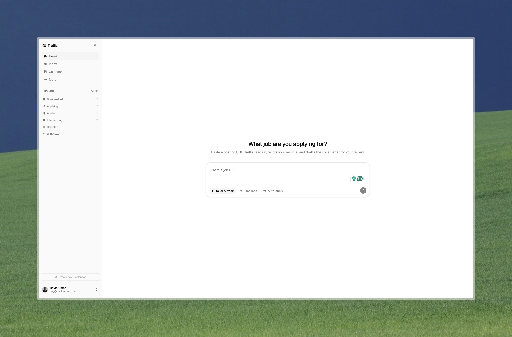

# Trellis

Your job hunt as a project, not a bookmark folder.



**Live demo:** [trellis.davidumoru.me](https://trellis.davidumoru.me)

Paste a job URL and an agent researches the role, tailors your resume, drafts the cover letter, and tracks every conversation in a structured pipeline. Every agent action shows its plan before executing, and nothing is saved without your approval.

Trellis was built for the Google Cloud Rapid Agent Hackathon but never submitted; the deadline arrived before the project fit the rules. It lives on as a personal project, built with Gemini 3 and MongoDB Atlas.

## The problem

A serious job search means dozens of parallel applications, each deserving a tailored resume, a researched cover letter, and timely follow-ups. In practice it becomes a spreadsheet with 47 half-tracked rows, lost recruiter emails, and generic applications. The effort that gets people hired is exactly the effort that doesn't scale by hand.

## What it does

**Intake: paste a job, get an application.** Drop a posting URL on the Home screen. The agent shows its plan, then executes it step by step in view: fetches and validates the posting, extracts structured details, proposes conservative resume changes (with the reasoning for each), and drafts a cover letter. You review everything inline and approve. On approval, Trellis applies the accepted changes to your base resume in the background and produces a ready-to-send tailored resume, downloadable as a typeset PDF along with the cover letter.

**Memory: ask anything about your search.** "Have I ever talked to anyone at Linear?" The agent expands your query, runs vector search across your applications, conversations, and documents in MongoDB Atlas, and synthesizes an answer with citations that click through to the source records. When it has nothing relevant on file, it says so instead of guessing.

**Sync: nothing falls through.** Connect Google once and recruiter emails land as conversation threads on the right application, calendar invites link to the right role, and detected interviews move applications forward in the pipeline automatically.

## Architecture

```text
Next.js 16 (App Router)
  ├── app/api/agent/*        streaming agent endpoints (plan → act → approve)
  ├── lib/agent/*            intake, memory (HyDE + vector search), finalize,
  │                          gmail/calendar sync, embeddings
  ├── lib/pdf.tsx            markdown → typeset PDF (@react-pdf/renderer)
  └── MongoDB Atlas          all collections + Atlas Vector Search
        Gemini 3 Flash       every generation and embedding step
```

The agent layer streams its plan to the UI before executing, emits per-step progress events, and renders artifacts inline under the step that produced them. Approval is a first-class gate: nothing writes to the pipeline until the user signs off.

## Why MongoDB

MongoDB is load-bearing here, not decorative:

- **The data model is documents.** Applications with embedded structured job descriptions and timelines, conversations with embedded message arrays, versioned artifacts. No join tables, no impedance mismatch.
- **Atlas Vector Search is the agent's memory.** Every collection carries an `embedding` field indexed by Atlas Vector Search. The memory loop runs HyDE-expanded `$vectorSearch` queries across collections and cites the records it retrieved. Full conversation threads are embedded (not individual messages) to avoid fragment retrieval.
- **Persistent agent state.** Every artifact the agent produces (resume diffs, finalized resumes, cover letters, research) is a versioned document linked to its application, so the agent can reason over its own past work.

## Tech stack

Next.js 16 · React 19 · TypeScript · Tailwind CSS 4 · shadcn/ui · MongoDB Atlas (Vector Search) · Gemini 3 Flash · better-auth (email OTP + Google) · Resend · @react-pdf/renderer · unpdf · Motion

## Setup

```bash
git clone https://github.com/davidumoru/trellis
cd trellis
pnpm install
cp .env.example .env   # fill in the values below
pnpm dev
```

Required environment variables:

| Variable                                    | Purpose                                             |
| ------------------------------------------- | --------------------------------------------------- |
| `MONGODB_URI`                               | MongoDB Atlas connection string                     |
| `AI_GATEWAY_API_KEY`                        | Vercel AI Gateway key (Gemini 3 Flash + embeddings) |
| `BETTER_AUTH_URL` / `BETTER_AUTH_SECRET`    | Auth base URL and signing secret                    |
| `RESEND_API_KEY`                            | Sign-in code emails                                 |
| `GOOGLE_CLIENT_ID` / `GOOGLE_CLIENT_SECRET` | Google OAuth for Gmail/Calendar sync                |
| `NEXT_PUBLIC_APP_URL`                       | Public app URL                                      |

Create an Atlas Vector Search index named `vector_index` on the `embedding` field of the `applications`, `conversations`, and `artifacts` collections (one index per collection, cosine similarity).

## Roadmap

- **Maintenance loop** — scheduled pipeline review that flags stale applications and unreplied threads, with follow-up drafts ready for one-click approval
- **Find jobs** — the agent scouts postings that match your profile and queues them for intake
- **Auto-apply** — hands-off submission for roles you approve
- **Offer evaluation** — compensation benchmarking when offers land
- **Standout deliverables** — agent-proposed portfolio pieces tailored to each company

## License

[MIT](LICENSE)
